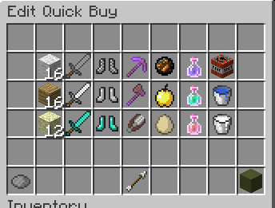

# Hypixel Bedwars Inventory Setup Mod (Forge 1.8.9)

A Forge 1.8.9 mod for **Hypixel Bedwars** that allows you to quickly load in your quick buy menu and hotbar layout with simple commands.

---

## Commands

### `/invsetup load`

Loads your inventory setup from the configuration file (`config/inv-setup.json`).

### `/invsetup delay <ticks>`

Sets the delay (in ticks) between actions.

> **Note:** Lower values make the setup faster, but consider your ping to avoid missed inputs.

---

## Config File: `inv-setup.json`

You can manually customize your layout by editing the `inv-setup.json` file.

### `main.quick-buy`

* This array controls the quick buy menu.
* Every **7 items** in the array represent a **row**.
* Just modify the items in the array to match your desired setup.

> **Example (in default config):**
> 
> 

### `main.hotbar`

* This array defines your **hotbar layout** in order (left to right).